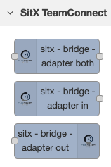

# SitX Bridge Adapter
[Node-RED](https://www.nodered.org/) nodes for sending messages to [PAR Government Sit(X)](https://pargovernment.com/sitx) Servers using BridgeAdapters. 

## Prerequisites
In your Sit(X) server set up a new Bridge Adapter under Account Settings -> Bridge Adapters. If you do not see an option for Bridge Adapters, please contact your Sit(X) reprepresentative to have it enabled for your account.

## Install
Ensure you have `npm` installed and it is up-to-date. Clone this repository and within the directory, run `npm install`. This will generate a `node_modules` directory. 

Once that has been run we can add this to Node-RED using the [developer testing](https://nodered.orgdocs/creating-nodes/first-node#testing-your-node-in-node-red) flow. Change into your node-red user directory (typically `~/.node-red`) and run `npm install <location of where you cloned this repository>`. Then restart your Node-RED server to pick up the changes.

Once your Node-RED server has restarted, open the hamburger menu and go to Manage Palette. You should see the `node-red-contrib-sitx-bridge-adapter` as a Node in your Palette.

## Configuring

Within the Node-RED workflow you want to use this, drop a SitX TeamConnect node onto your workflow. You can choose an "in" adapter (for incoming messages to Node-RED), "out" adapter (for outgoing messages to Sit(X)) or "both" (bi-directional communications). This must match the scope you set up for your Bridge Adapter.

Double-click on the node to bring up the Properties node. 

 * Name is the display name of the Node in your workflow
 * Enter the GroupURI as the `https` URL to your group. As an example, for a server called `yourorg` and a group `sitx-group-12a3bc4d` you would put `https://yourorg.takserver.parteamconnect.com/sitx-group-12a3bc4d` without the bridge scope
 * Your AccessKey should be the Access Key ID from your Bridge Adapter
 * Your SecretKey should be the Secret Key from your Bridge Adapter

Once you deploy your workflow the SitX node should show a "connected" status underneath it. This means you are connected. If this does not show up, please check your debug / console logs.

## Usage

The easiest way to send CoT messages is through the [node-red-contrib-tak](https://github.com/snstac/node-red-contrib-tak) set of nodes. Using these, you would drop a `TAK` node onto your workflow, send it the JSON representation of your CoT, and then send the output of it to the Sit(X) node. If using this method, it is imperative you connect the nodes using the top-most output (Node Output 1) from the TAK node as shown below.

Alternatively you can create your CoT XML strings in whatever manner works best and send them directly to the Sit(X) node.
